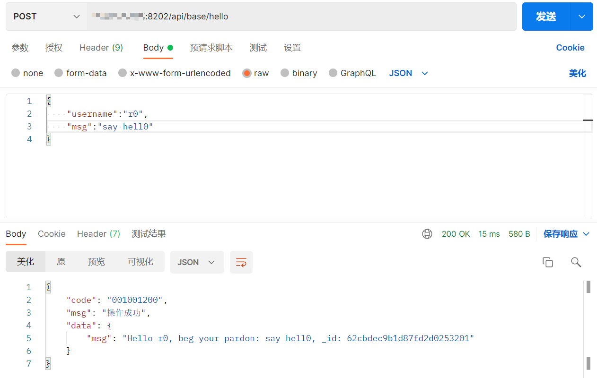
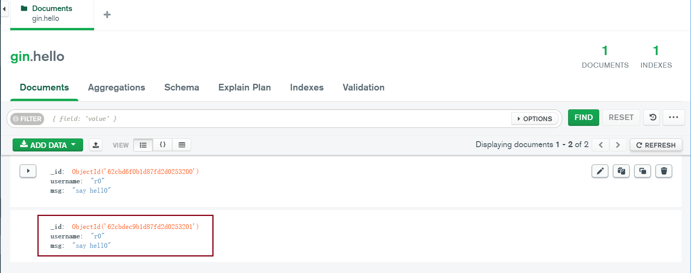

# gin-mongo5镜像脚手架实战

## Apt更新、包安装

构建源 <code>FROM ubuntu:18.04</code>

由于后续mongo的运行需要依赖<code>libcurl4</code>和<code>openssl</code>，所以先更新apt-get的源至<code>/etc/apt/sources.list</code>

增加参数<code>--fix-missing</code>忽略丢失的包，该选项确保在APT不返回错误的情况下执行更新过程^[2]^。

增加参数<code>-o Acquire::http::No-Cache=True</code>禁止缓存，防止出现使用某些网关缓存的可能^[3]^。

此步完成apt的源的更换、更新，以及<code>libcurl4</code>和<code>openssl</code>的安装。

```dockerfile
RUN sed -i "s@/archive.ubuntu.com/@/mirrors.tuna.tsinghua.edu.cn/@g" /etc/apt/sources.list \
    && sed -i "s@/security.ubuntu.com/@/mirrors.ustc.edu.cn/@g" /etc/apt/sources.list\
    && rm -Rf /var/lib/apt/lists/* \
    && apt-get update --fix-missing -o Acquire::http::No-Cache=True \
    && apt-get install libcurl4 openssl -y
```

**在内网环境下，请不要进行apt源的更换！！！**

-----

## 准备文件

本文目标是完成golang与MongoDB的环境构建，直接下载对应版本的可执行文件来完成此工作。

而源码的准备，我们可以使用wget现场下载，但在网络状况不良的时候，最好是在物理机上准备好文件，再<code>COPY</code>到容器中。

我们可以：

1. docker中写两种方式，需要时注释掉另一种。**这意味着用户需要自行修改docker文件。**

2. build一个父镜像并提供两个“分支”的<code>ONBUILD</code>^[4]^，在子镜像中硬编码“FROM分支”来完成这个操作。

    ```dockerfile
    ARG BUILD_ENV=copy

    FROM alpine as build_copy
    ONBUILD COPY file /file

    FROM alpine as build_no_copy
    ONBUILD RUN echo "I don't copy"
    # hard code to change?
    FROM build_${BUILD_ENV}
    # other stuff
    ```

    缺点是，后续的FROM的修改也需要用户来进行

    而且父镜像中实际上也会执行wget，这样的话就做不到我们想象的“在网络状况不良的时候，最好是在物理机上准备好文件，再<code>COPY</code>到容器中”了。

3. 物理机上始终尝试<code>COPY</code>到容器，容器执行一个shell脚本判断文件是否存在，不存在就wget下载到指定目录^[4]^。

    1. Docker去<code>COPY</code>不存在的文件会报错，但可以使用以下的办法。

        ```dockerfile
        COPY foo file-which-may-exis[t] /tmp
        ```

        只要保证第一个文件（foo）存在，后续文件就会“尽力复制”

    2. 这是一个解决方法，而且不需要修改到docker，只是要额外提供一个sh脚本。

4. 不以dockerfile直接启动，借由sh脚本检测文件是否存在并修改docker的内容。
    缺点是，dockerfile必须提供“占位符”来让sh脚本进行相应的替换，**这样dockerfile会存在“无法解析变量”的bug**。
    好处是，用户全程无感操作，只要会执行sh脚本就行了，并且sh脚本还能负责后续的镜像<code>build</code>和容器的运行。

使用第4种的方式完成文件准备，原理较为简单，就是使用一个额外的sh脚本来完成以下工作：

1. 遍历**硬编码的文件列表**，检测同目录下是否存在该文件。
2. 对于不存在的列表，将其对应的wget需要使用的url转义后加入到wget队列中。
3. 对于存在的列表，将该文件名的转义名加入到copy队列中。
4. 遍历wget队列和copy队列，构造对应的<code>wget_apply_str</code>和<code>copy_apply_atr</code>字符串。
5. 利用sed，用上述两个字符串替换dockerfile中对应的占位符
6. 执行<code>docker build</code>
7. 以脱离模式运行容器

---

## 环境配置

上述工作完成后，只需要将上述阶段的产物复制出来，将环境变量设置好即可。

```dockerfile
COPY --from=os_file_apply /tmp/mongodb-linux-x86_64-ubuntu1804-5.0.9.tgz /tmp/
COPY --from=os_file_apply /tmp/go1.17.11.linux-amd64.tar.gz /tmp/
```

**设置环境变量时不可避免地会使用诸如<code>$GOROOT</code>的变量，\$号是需要转义的。**

*包括在编写此md文件时也需要转义  :(*

请设置到<code>~/.bashrc</code>中，尽量控制变量的作用范围。

另外，如果设置到<code>/etc/profile</code>，并且进容器时不是以login方式进入，就需要手动执行一次<code>source /etc/profile</code>，有亿点麻烦了。

完成<code> /bin/bash -c "source ~/.bashrc"</code>后，可以将对应的文件删除。

额外地，本文还准备了MongoDB数据和日志的存放目录，这需要与下文的mongod配置文件配合工作。

---

## mongod配置

使用配置文件的形式启动mongod，设置<code>ENTRYPOINT</code>，每次启动容器时都自动启动mongod。

```yaml
systemLog:
  destination: file
  path: /usr/local/mongodb/logs/mongod.log
  logAppend: true
storage:
  dbPath: /usr/local/mongodb/data/db
  journal:
    enabled: true
processManagement:
  fork: false
net:
  bindIp: 127.0.0.1
  port: 27017
security:
  authorization: enabled
```

这里需要将mongod设置为**”以前台模式运行“**

因为docker容器不是虚拟机，本质上是一个隔离进程，如果mongod以<code>fork=true</code>启动，启动之后将父进程exit之后，容器就停止了，那服务自然就不存在了。

注意bindIp配置值仅确定MongoDB服务端正在侦听的IP地址。它不能控制来自远程IP的访问权限——这应该是防火墙的工作。

**mongod启动后，请即时设置相关用户以及权限。**

----

## 提取、暴露端口

将容器的27017端口暴露出来，这也是我们在<code>mongod.conf</code>中设置的。

简陋地输入两个参数到sh，分别作为**mongod配置文件的路径和gin配置文件的路径**。

但如果mongod中的端口修改就要手动修改dockerfile，或者<code>mongod.conf</code>中的端口与dockerfile暴露的端口不一致也会出现问题。

gin启动所使用的配置文件也存在上述问题，所以将暴露端口的工作也交给sh脚本完成。

所以同样地：

1. 使用一个<code>${MONGOD_EXPOSE}</code>占位符，利用sh脚本读取<code>mongod.conf</code>中的端口并覆盖占位符。
2. 使用一个<code>${GIN_EXPOSE}</code>占位符，利用sh脚本读取<code>./config/config.yml</code>中的端口并覆盖占位符。
3. 提取<code>./config/config.yml</code>中mongo的目标连接端口，校验是否与<code>mongod.conf</code>中的一致。

此步骤完成后，docker中的<code>EXPOSE</code>就应当被设定妥当了。

----

## 自定义Docker网络

与上述步骤类似，需要在gin的配置文件（<code>./config/config.yml</code>）中配置对应的子网网段以及网关

将子网网段以及网关的配置提取出来后，以桥接模式配置Docker网络，后续运行容器时将两个容器都加入网络。

----

## 多阶段构建

分别构建一个“启动时能提供gin-web服务“的容器与一个”启动时提供mongo服务“的容器。

它们的父镜像只提供ubuntu18.04的环境和需要的文件（golang1.17可执行文件、mongo5可执行文件、项目文件）。

---

## 增加mongo管理员

额外地，本文中的gin demo连接MongoDB的后续操作，需要gin配置文件（<code>./config/config.yml</code>）中的用户和db配置妥当，而且用以验证和操作的用户在对应db下的权限至少为”readWrite“。

为了”尽量地无感操作“，本文在docker构建的阶段就配置对应的用户。

具体地

1. 对于mongod的配置文件设置”无认证“模式
2. 在构建镜像阶段以后台模式启动mongod，执行一个<code>tmp-mongo-add-admin.js</code>脚本^[18]^
   1. 脚本的内容就是在gin配置文件中需要连接的db下创建需要的用户，权限为”readWrite“。
   2. 增加一个Collection，名为”hello"，**这是必须的**，否则db不会被真正创建。
3. 以mongo_apply阶段构建镜像时，提供一个<code>ENTRYPOINT</code>，它**指定mongod以验证模式启动**

---

## HOW TO USE

下载本文的gin-mongo5-demo项目：https://github.com/boogieLing/gin-demo

此项目包含一个最小化的可运行的gin项目，它将在运行时连接到MongoDB，拥有一个接口<code>localhost:8202/api/base/hello</code>用以验证MongoDB的写入操作是否正常。





需要修改的仅有：

1. gin配置文件（<code>./config/config.yml</code>）中的mongo、docker、author相关配置。
2. mongod配置文件（<code>mongod.conf</code>）中的绑定的ip和端口。

**启动方式：**

```shell
chmod +x ./docker-build.sh && ./docker-build.sh
```

可以额外指定的：

1. 如果在gin配置文件中没有配置mongo下的username和password字段，那么可以以以下方式在脚本启动时指定。**格式：mongod配置文件名+

   ```shell
   chmod +x ./docker-build.sh && ./docker-build.sh -m mongod.conf+admin+password
   ```

2. 指定gin配置文件的路径

   ```shell
   chmod +x ./docker-build.sh && ./docker-build.sh -m mongod.conf+admin+password -g ./config.yml
   ```

---

## 仍存在的问题

1. **目前必须将<code>mongod.conf</code>放在与sh脚本同目录下，所谓的“额外指定”也只是指定文件名**。
2. 依赖Docker的COPY，所以只能拷贝上下文范围的文件。
3. 镜像依赖golang和mongo环境，这两者的可执行文件的下载地址都是**硬编码**到sh脚本中的，不够灵活。
4. 需要用户指定Docker网络的网关，可能会出现子网网段冲突的情况，也没有弥补措施。
5. mongod是以验证模式启动的，但没有一个全局的管理员，如果要合理使用的话，是需要用户后续自行增加的。

---

## FOLLOW

1. What does apt-get --fix-missing do and when is it useful?：https://askubuntu.com/questions/462690/what-does-apt-get-fix-missing-do-and-when-is-it-useful
2. How to Fix Broken Packages in Ubuntu：https://phoenixnap.com/kb/ubuntu-fix-broken-packages
3. BADSIG errors using transparent http proxies：https://bugs.launchpad.net/ubuntu/+source/apt/+bug/33505
4. ONBUILD 为他人作嫁衣裳： https://yeasy.gitbook.io/docker_practice/image/dockerfile/onbuild
5. docker-Dockerfile中的条件复制/添加？：https://www.itranslater.com/qa/details/2326189286145655808
6. dockerfile COPY命令失效：https://www.cnblogs.com/yourstars/p/15609202.html
7. Dockerfile 多阶段构建：https://yeasy.gitbook.io/docker_practice/image/multistage-builds
8. Why my Ubuntu container doesn't execute profile scripts?：https://ops.tips/blog/why-ubuntu-doesnt-execute-profile-scripts/
9. mongodb.conf bind_ip = 127.0.0.1 does not work but 0.0.0.0 works：https://stackoverflow.com/questions/17588876/mongodb-conf-bind-ip-127-0-0-1-does-not-work-but-0-0-0-0-works
10. Configuration File Options：https://www.mongodb.com/docs/manual/reference/configuration-options/
11. MongoDB - Bind_IP Breaking changes and Replica set broken：https://serverfault.com/questions/895195/mongodb-bind-ip-breaking-changes-and-replica-set-broken
12. bash-yaml：https://github.com/jasperes/bash-yaml
13. 进入ENTRYPOINT运作出错的docker容器：https://blog.csdn.net/rookie_wei/article/details/119381605
14. Go 项目上线后优雅的重启项目以及项目后台运行：https://www.uiucode.com/view/38.html
15. 如何清理Docker占用的磁盘空间? ：http://dockone.io/article/3056
16. 容器互联：https://yeasy.gitbook.io/docker_practice/network/linking
17. mongo进阶6——js脚本操作mongo：https://zhuanlan.zhihu.com/p/474577721
18. Create a new user for MongoDB inside Docker：https://serverfault.com/questions/776664/create-a-new-user-for-mongodb-inside-docker

